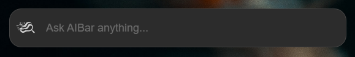

# AIBar



AIBar is a lightweight and fast desktop search bar. It allows you to quickly query various AI search engines directly from your desktop, opening the search in your default browser.

## ✨ Features

- **Quick Access**: Launch the search bar with a configurable keyboard shortcut.
- **Multi-AI**: Supports multiple AI search engines.
- **Customizable**: Add, remove, reorder, and set a default AI through the built-in settings panel.
- **Lightweight**: Built with Rust and web technologies for minimal resource consumption.

## 🚀 How it Works

1. Open AIBar using its keyboard shortcut.
2. Type your question or search term.
3. Click the logo to select the AI you want to use or use default one.
4. Press Enter. AIBar will open a new tab in your browser with the query sent to the chosen AI.

## 🛠️ Installation and Development

To run the project locally, follow these steps:

1. **Clone the repository:**

   ```bash
   git clone https://github.com/Ed0ardo/aibar.git
   cd aibar
   ```

2. **Install dependencies:**

   ```bash
   npm install
   ```

3. **Run in development mode:**

   ```bash
   npm run tauri dev
   ```

## ⚙️ Customization: Adding a New AI

You can easily manage your AI engines through the application's settings window.

1. Open the settings panel.
2. Click the **"Add New AI"** button.
3. A modal window will appear. Fill in the following fields:
   - **AI Name**: The name you want to display in the list (e.g., "Perplexity").
   - **Search URL**: The full URL for making a search query. The app will append your search term to the end of this URL.
   - **Logo (optional)**: You can upload a PNG image to be used as the logo. If not provided, a default icon will be used.
4. Click **"Add AI"** to save it.

You can also delete, reorder (drag-and-drop), and set a default AI from the settings panel.

### AI Examples

Here are some example values you can enter in the settings panel to add popular services:

**Perplexity:**

- **Name**: `Perplexity`
- **URL**: `https://www.perplexity.ai/search?q=`

**ChatGPT:**

- **Name**: `ChatGPT`
- **URL**: `https://chatgpt.com/?q=`

**Copilot:**

- **Name**: `Copilot`
- **URL**: `https://copilot.microsoft.com/?q=`

**Mistral:**

- **Name**: `Mistral`
- **URL**: `https://chat.mistral.ai/chat/?q=`

## 📦 Build

To build the application for production, run:

```bash
npm run tauri build
```
